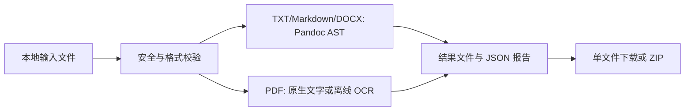

# 本地离线文档互转工具


[](https://github.com/tylmcy/local-doc-converter/actions/workflows/tests.yml)

一个面向个人使用与作品集展示的本地网页工具，可在 TXT、Markdown 和 DOCX 之间批量转换文档，并支持 PDF → TXT。所有文件都在本机处理，不调用 AI API，不上传云端。OCR 模型只在用户显式执行准备命令时下载，日常转换不依赖在线服务。

## 项目状态

当前稳定版本为 **v2.0.0**。v1 的六条转换路径保持兼容，本版正式加入 PDF → TXT。九份固定真实 PDF 的自动硬性门槛与网页五文件批量交付均已验收；固定五页旧印刷体在冻结人工参考上取得 93.14% 正式字符正确率，达到 V2 的 90% 发布门槛；123 项自动测试和发布前终检已通过。旋转密集表、跨栏密集表、复杂表单/公式和图片内文字仍有明确限制。当前不制作安装包。

## 功能

- 支持 TXT → Markdown、TXT → DOCX。
- 支持 Markdown → TXT、Markdown → DOCX。
- 支持 DOCX → Markdown、DOCX → TXT。
- 支持文本型 PDF 原生提取为 TXT，不需要 Pandoc 或 OCR。
- 文本型 PDF 可恢复有稳定分栏证据的双栏、三栏阅读顺序、跨栏标题、有框表格和保守的三列以上无框表格。
- 对相邻原生文字页的长段完全重复前缀进行保守去重，避免被裁切但仍留在 PDF 文字层中的内容跨页重复。
- 扫描型、混合型或文字层异常的 PDF 按页回退到本地 PaddleOCR PP-OCRv5。
- 对网格线清晰的横排扫描表格，按单元格坐标恢复 Tab 分隔的行列；同时提供 150/300 PPI 扫描样例与 150/200/300 DPI 离线对照。
- 高置信的中文竖排扫描会按右列到左列重排，左右双页扫描也按右页优先。
- 多页竖排扫描可清理重复页边标题，识别到的原书页码保存在逐页报告中。
- PDF 进入解析前检查文件头、结构、加密、页数、对象数、页面尺寸和主动内容标记。
- PDF 预检、分类和原生文字提取在一次性子进程中运行，60 秒超时后终止当前文件。
- PDFium 渲染和 PaddleOCR 在文件级子进程中串行处理；模型启动超时 30 秒，单页渲染/OCR 超时 60 秒。
- 网页批量上传，单批最多 100 个文件、总计 200 MB。
- 自动识别 UTF-8、GBK、GB18030 等常见中文文本编码。
- 通过离线规则识别 TXT 中的中文章节、数字标题、短行标题、列表、简单表格和缩进代码块。
- 尽可能保留标题、段落、列表、表格、代码块、链接和图片语义。
- 每个文件生成 JSON 转换报告，包含结构统计、警告和潜在格式损失。
- DOCX 在进入 Pandoc 前检查 ZIP 路径、解压体积、压缩比、加密、符号链接和 CRC。
- 结果写入本地目录；页面可下载单个文件或包含结果、图片资源和报告的 ZIP。
- 临时文件在每次任务结束后自动清理；已有文件不会被覆盖。

## 运行环境

本项目以 MacBook Air M5（Apple Silicon）为目标环境，推荐：

- macOS
- Python 3.12（项目兼容 Python 3.12 及以上）
- [Pandoc](https://pandoc.org/) 3.x
- [uv](https://docs.astral.sh/uv/) 作为 Python 环境与依赖管理器

首次安装需要联网下载依赖；安装完成后，文档转换过程可完全离线运行。

## 安装

在项目目录打开终端：

```bash
cd local-doc-converter
```

安装系统工具：

```bash
brew install pandoc uv
```

安装 Python 3.12 与项目依赖：

```bash
uv python install 3.12
uv sync --extra dev
```

确认环境：

```bash
uv run python --version
pandoc --version
```

如果不使用 `uv`，也可以用 Python 3.12 创建虚拟环境后执行 `pip install -e '.[dev]'`。

### PaddleOCR 可选安装

只处理文本型 PDF 时可跳过本节。扫描 PDF 需要以下三步；下载依赖和模型时需要联网，完成后可断网转换。MacBook Air M5 已验证的组合为 PaddlePaddle 3.3.0 和 PaddleOCR 3.7.0：

```bash
uv pip install paddleocr==3.7.0
uv pip install paddlepaddle==3.3.0 --index-url https://www.paddlepaddle.org.cn/packages/stable/cpu/
uv run python scripts/prepare_paddleocr_models.py
```

准备脚本默认只下载项目固定的 `PP-OCRv5_mobile_det`、`PP-OCRv5_mobile_rec` 和 `PP-LCNet_x1_0_doc_ori`，默认保存在 `~/Library/Application Support/LocalDocConverter/models`，合计约 27 MB。若需要识别旧印刷体，可显式增加约 81 MB 的高精度识别模型：

```bash
uv run python scripts/prepare_paddleocr_models.py --high-accuracy
```

高精度模型存在时会自动优先使用；模型选择会写入逐页报告。只在准备时联网，转换时仍完全离线。如需改用其他目录：

```bash
uv run python scripts/prepare_paddleocr_models.py --model-dir /your/local/model/path
export LOCAL_DOC_CONVERTER_PADDLE_MODEL_DIR=/your/local/model/path
```

转换程序会先检查三个基础模型目录；缺失时直接报错，不会在处理文件时静默下载。OCR 完整 Python 环境约 875 MB，基础模型实测峰值内存约 2.0–2.8 GB，因此当前按页串行识别。高精度模型会额外占用磁盘和内存；旧书仍应人工校对。

旧印刷体可选用实验性增强：网页勾选“旧印刷体增强”，或在 CLI 增加 `--ocr-profile old_print`。该模式将需要 OCR 的页面以 300 DPI 渲染，并在识别前做 3×3 中值去噪；默认 `standard` 仍是 200 DPI、无去噪。请把两次输出保存到不同目录逐页比较：增强模式可能改善部分旧字，也可能漏字或产生杂字。固定五页旧书的正式发布评分使用默认 `standard` 和本地高精度识别模型，在冻结人工参考的 5012 字上取得 93.14%；这只证明该固定样例达到门槛，不代表任意旧书都能达到相同准确率，也不证明增强模式更优。报告会记录所选模式；普通现代扫描件建议保持默认。

## 启动网页界面

推荐直接运行：

```bash
./scripts/start.sh
```

如果脚本没有执行权限，先运行：

```bash
chmod +x scripts/start.sh
```

也可以手动启动：

```bash
uv run streamlit run app.py --server.address=127.0.0.1
```

浏览器通常会自动打开 `http://localhost:8501`。仓库内的 Streamlit 配置会把服务绑定到 `127.0.0.1`，避免暴露到局域网；本项目代码不会向外部服务发送文档。

## 网页使用方法

1. 上传一个或多个 `.txt`、`.md`、`.markdown`、`.docx` 或 `.pdf` 文件。
2. 选择 TXT、Markdown 或 DOCX 目标格式。
3. 填写本地输出目录。为避免误写系统目录，目录必须位于当前用户主目录的子目录中。
4. 点击“开始转换”，程序会先校验输出目录，再开始处理文件。
5. 通过逐文件进度查看当前处理状态。与目标格式相同的输入会标记为“已跳过”，不计为失败。
6. 在“结果概览”和“详细报告”中查看结构统计、编码、警告和错误。
7. 下载单个结果或包含全部结果、媒体资源和报告的 ZIP，也可以直接在访达中打开输出目录。

输出文件默认写入项目下的 `converted/`，并保留原文件名，只替换扩展名。例如 `会议记录.txt` 转 Markdown 后得到 `会议记录.md`。如果同名文件已存在，会生成 `会议记录_2.md`、`会议记录_3.md` 等名称，不覆盖已有文件。

## 命令行使用

命令行适合脚本化和快速验证：

```bash
uv run local-doc-converter examples/input/中文结构示例.txt --to markdown --output examples/output
```

批量转换：

```bash
uv run local-doc-converter examples/input/中文结构示例.txt examples/input/代码与列表.txt --to docx --output converted
```

`--to` 可选值为 `txt`、`markdown`、`docx`。

PDF 当前仅能使用 `--to txt`。文本型 PDF 不依赖 Pandoc；只有实际需要 OCR 的页面才会延迟加载 PaddleOCR。

对照旧印刷体两种 OCR 参数：

```bash
uv run local-doc-converter 旧书.pdf --to txt --output converted/default
uv run local-doc-converter 旧书.pdf --to txt --ocr-profile old_print --output converted/old-print
```

## 转换流程

```text
输入文件
  → 文件类型、文件名、大小和输出路径校验
  → DOCX ZIP 安全预检（仅 DOCX 输入）
  → PDF 安全预检、页面分类（仅 PDF 输入）
      → 独立短生命周期子进程，父进程执行 60 秒超时控制
      → 正常文字层：词级坐标、双栏顺序与 Tab 表格恢复
      → 扫描页/可疑文字层：启动文件级 OCR 子进程
          → 一次加载 PP-OCRv5，按页 PDFium 渲染 + PaddleOCR
          → 30 秒启动超时，60 秒单页心跳超时
  → PDF 路径：逐页清理、纯文本输出和质量报告（无需 Pandoc）
  → V1 路径：TXT 编码检测 / Pandoc Reader
      → Pandoc JSON AST、结构清理和图片安全检查
      → Pandoc Writer、DOCX 中文基础样式补充
  → 结果文件和 JSON 报告
  → ZIP 打包
  → 清理任务临时目录
```



TXT 会先由本地规则整理为结构化 Markdown，再交给 Pandoc 生成 JSON AST。规则优先识别：

- `第一章`、`第二节`、`第3篇`。
- `一、`、`（一）`。
- `1.`、`1.1`、`1.1.1`。
- `-`、`*`、`+` 和数字列表。
- Markdown 管道表格、制表符分隔的简单表格。
- 四空格或 Tab 缩进代码块。
- 前后为空行、不以句末标点结尾的短行标题。

短行标题属于低置信度推断，报告会提示人工核对。

## 转换报告

每个输入文件旁会生成一个 `*_report.json`，主要字段包括：

- 转换是否成功、是否跳过和可理解的错误原因。
- 源格式、目标格式、输出文件和耗时。
- TXT 检测到的编码。
- 标题、列表、表格、代码块、链接和图片数量。
- 处理警告。
- 可能丢失的格式。
- PDF 类型、总页数、原生提取页、OCR 页、空白页、双栏页、结构化/复杂/降级表格数、逐页质量分数、OCR 模型、原书页码候选和 OCR 平均置信度。

批量 ZIP 还包含 `batch_report.json` 汇总报告。某个文件失败不会中断同批次其他文件。

## 支持范围

| 内容 | TXT | Markdown | DOCX | PDF → TXT |
|---|---|---|---|---|
| 标题 | 规则推断 | 支持 | 支持常见标题样式 | 保留可见文字，语义级别待加固 |
| 段落 | 支持 | 支持 | 支持 | 按原生行或 OCR 文字块输出 |
| 列表 | 规则推断 | 支持 | 支持常见列表 | 保留可提取的编号和文本 |
| 表格 | 简单管道/Tab 表格 | 支持常见表格 | 支持常见表格 | 原生有框表格、清晰网格扫描表格输出 Tab 列；合并/多行单元格降级，保守处理无框表格 |
| 代码块 | 缩进/围栏 | 支持 | 以样式化文本为主 | 不保证保留代码缩进 |
| 链接 | Markdown 链接可识别 | 支持 | 支持常见超链接 | 仅可见文字，不访问目标 |
| 图片 | 仅引用 | 本地同目录图片可嵌入 | 转 Markdown 时提取并打包 | 不输出图片；扫描页可 OCR |

为了保持真正离线，远程图片不会下载；生成 DOCX 时会把远程、缺失或越过文档目录的图片降级为普通链接。

## DOCX 安全预检

DOCX 是 ZIP 容器。程序会在 Pandoc 读取前进行只读、流式预检，不把容器内容提取到磁盘：

- ZIP 条目最多 5,000 个。
- 解压后总大小最多 500 MB，单个条目最多 100 MB。
- 总压缩比最多 200 倍，单个条目最多 1,000 倍。
- 拒绝路径穿越、绝对路径、反斜杠路径、符号链接、加密条目、重复条目和损坏 CRC。
- 宏、OLE 嵌入对象和外部关系不会执行或主动访问，但会写入转换警告。

该预检用于降低异常压缩和恶意 ZIP 结构造成的资源风险，不是病毒或恶意代码扫描器。

## 已知限制

- DOCX 不是精确版式格式转换。页眉页脚、批注、修订记录、文本框、宏、SmartArt、目录域、复杂浮动对象和精确分页可能丢失。
- 复杂合并单元格、嵌套表格和 Word 专有样式可能被简化。
- Markdown 上传到网页时只上传了单个文档，无法自动取得其旁边未上传的本地图片；命令行转换可读取 Markdown 文件同目录内的图片。
- DOCX 转 Markdown 会把媒体提取到与输出同级的资源目录。移动 Markdown 文件时应同时移动该目录。
- TXT 结构识别基于规则而非语义模型，短标题、中文序号列表和标题之间可能存在歧义。
- Markdown 表格必须使用至少三个连字符作为表头分隔语法；工具会把 Pandoc 产生的长分隔线压缩为最短合法形式 `---`，但不能完全删除。
- TXT 目标天然不能保留图片、字体、颜色、表格边框和精确列表样式。
- 当前版本顺序执行批次，优先保证稳定和可解释，不针对超大文档并行加速。
- DOCX 预检不能判断宏、嵌入对象或正文内容是否包含恶意代码；不可信来源文件仍应使用系统安全工具检查。
- PDF 没有统一的段落和阅读顺序语义；稳定双栏和三栏已支持，但短页混合分栏、不规则文本框、跨页段落、脚注和公式仍可能错序。
- 两列无框表格与双栏正文很难稳定区分，当前不强制恢复；扫描表格仅支持清晰横竖网格，倾斜/模糊扫描、跨页、嵌套及合并结构可能降级。
- 混合页的原生文字层正常时不会对整页图片重复 OCR，因此插图内的额外文字可能不在 TXT 中。
- PaddleOCR 识别质量受分辨率、模糊、倾斜、压缩和字体影响；置信度不能代替人工校对。
- 竖排列序只在多个细长中文块等特征充分时启用；重复页边标题和页码可保守清理，但独有的页边文字、横竖混排和旧式繁体印刷仍可能需要人工整理。
- PDF 解析与渲染/OCR 都已实现子进程超时隔离，但这不等于完整的操作系统沙箱，也没有为子进程设置绝对内存上限。

发布后质量改进分别跟踪于 [旋转密集表格](https://github.com/tylmcy/local-doc-converter/issues/1)、[跨栏表与图片文字](https://github.com/tylmcy/local-doc-converter/issues/2)、[复杂表单/公式与中英混排](https://github.com/tylmcy/local-doc-converter/issues/3) 和 [倾斜、模糊、真实扫描表格样例](https://github.com/tylmcy/local-doc-converter/issues/4)。私人文档不会直接提交到仓库，只接受公开来源、自制或完成脱敏的最小复现。

## 自动化测试

运行全部测试：

```bash
uv run pytest
```

测试包括编码识别、TXT 规则、AST 统计、路径安全、DOCX 容器预检、PDF 预检与页面分类、原生文字提取、双栏顺序、合并/多行单元格、无框表格及单栏误判回归、解析子进程 PID/超时/错误传递、OCR 子进程模型复用/进度心跳/启动超时/页码校验、文字层质量判定、OCR 结果解析与按页回退、同名避让、批处理和 ZIP 内容。CI 不下载大型模型，本机另执行真实 PP-OCRv5 端到端验证。

### 真实 PDF 质量样例

仓库保存固定版本来源、SHA-256、验收阈值和人工复核结论，但不重新分发第三方 PDF。样例需显式下载到 Git 忽略的本地目录：

```bash
uv run python scripts/download_pdf_corpus.py
uv run python scripts/evaluate_pdf_corpus.py
```

当前 9 份样例覆盖英文三栏与旋转表格、简体中文单栏、中英混排、现代简体横排真实扫描、旧式繁体竖排真实扫描、有框/无框/跨行表格及多页文档。繁体竖排 OCR 已能恢复主要列序并清理重复页边标题；高精度模型改善了若干旧印刷体词语，但仍有错字/漏字。下载、评测、许可边界和人工复核规则见 [真实 PDF 质量样例集说明](quality/pdf_corpus/README.md)。

2026-09-24 的 [人工关键页复核记录](docs/validation/2026-09-24-v2-pdf-manual-closeout.md) 将自动 9/9 与三份仍未解决的布局 `known-issue` 分开记录。固定五页旧印刷体的人工参考在评分前冻结，默认配置按逐页编辑距离取得 93.14%，五页最低为 91.16%；完整公开汇总见 [旧印刷体正式评分记录](docs/validation/2026-09-24-old-print-formal-score.md)。该数字不代表其他旧书的准确率。

联邦公报样例已修复主三栏正文的跨栏交错及整页伪表格；清华样例第 6–8 页的三处大段跨页重复已清理。密集跨栏表格、图片内文字、表单与数学公式仍需人工核对，详见 [三栏与跨页质量验证](docs/validation/2026-09-23-pdf-three-column-overlap-validation.md)。

另有仓库自制的中文扫描表格 PDF，带标准答案，可直接离线复现 150/300 PPI 源扫描与 150/200/300 DPI OCR 渲染对照。清晰样例的 6 组均恢复 8 行 Tab 表格、命中 39/40 个单元格（长破折号漏识）；因此暂保留生产默认 200 DPI，详情见 [扫描表格与分辨率验证](docs/validation/2026-09-23-scanned-table-dpi-validation.md)。

## 演示文件

`examples/input/` 包含 TXT、Markdown 和 DOCX 输入样例；`examples/output/` 包含 V1 六路径的实际输出和 JSON 报告。V2 另提供项目自行生成、可再分发的 [150 PPI 中文扫描表格 PDF](quality/pdf_corpus/generated/scanned-table-150ppi.pdf) 及其 [TXT 输出](examples/output/scanned-table-150ppi.txt) 和 [转换报告](examples/output/scanned-table-150ppi_report.json)。它演示离线 OCR 与 Tab 表格恢复，不用于证明任意真实扫描件的准确率。九份第三方真实 PDF、全文 TXT 和渲染图仅本地保存，不进入仓库。

## 常见问题

### 页面提示“未找到 Pandoc”

运行：

```bash
brew install pandoc
```

安装后停止并重新启动 Streamlit。可用 `pandoc --version` 验证。

### 中文出现乱码

报告中会记录检测到的编码。工具优先识别 UTF-8，再尝试 charset-normalizer 和 GB18030。若极短文本或混合编码仍判断错误，请用文本编辑器另存为 UTF-8 后重试。

### 为什么不能写到 `/tmp` 或系统目录

网页输入的输出目录仅允许位于当前用户主目录下，以减少路径误输和不可信文件造成的风险。推荐使用 `~/Documents/文档转换输出` 或项目内的 `converted/`。

## 项目结构

```text
app.py                         Streamlit 页面
src/local_doc_converter/       分层转换核心
tests/                          自动化测试
docs/designs/                   分项设计文档
examples/input/                 演示输入
examples/output/                实际转换示例与报告
scripts/start.sh                macOS 启动脚本
scripts/prepare_paddleocr_models.py  PP-OCRv5 显式模型准备脚本
scripts/download_pdf_corpus.py  固定哈希的真实 PDF 样例下载器
scripts/evaluate_pdf_corpus.py  真实 PDF 自动验收与报告生成器
scripts/generate_scanned_table_fixture.py  自制中文扫描表格生成器
scripts/compare_scanned_table_dpi.py  扫描源 PPI × OCR 渲染 DPI 对照
quality/pdf_corpus/             可复现清单、验收阈值与人工复核结论
设计文档.md                     架构、风险与实施说明
```

更详细的模块边界、安全策略和取舍见 [设计文档.md](设计文档.md)；DOCX 预检的阈值、失败行为和测试策略见 [DOCX 安全预检设计文档](docs/designs/2026-09-22-docx-safety-preflight.md)，真实样例集设计见 [PDF 真实质量样例集设计](docs/designs/2026-09-23-pdf-quality-corpus.md)。

## 许可证

本项目使用 [MIT License](LICENSE)。
